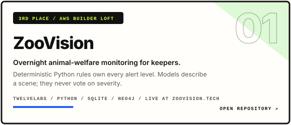
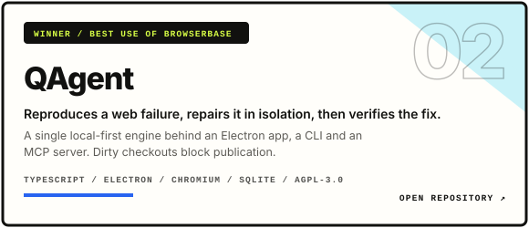
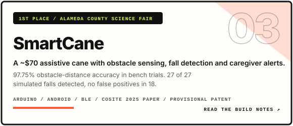
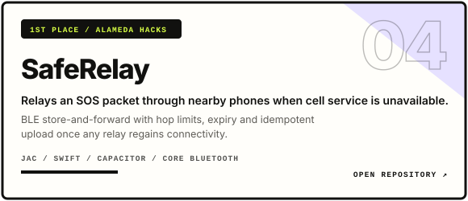
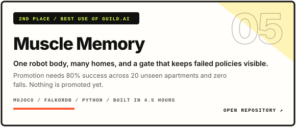
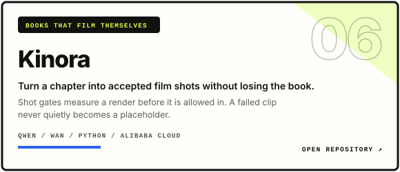
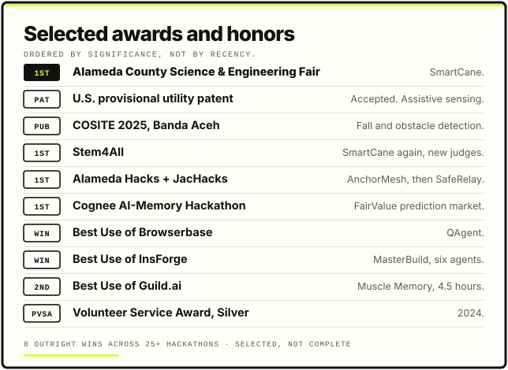
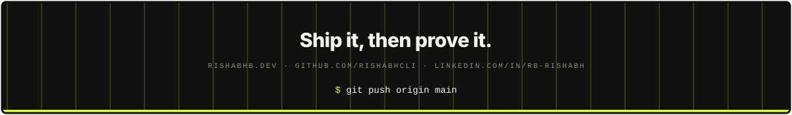

<!--
  github.com/rishabhcli profile README
  Visual direction: bone paper, ink, acid lime. Same palette as rishabhb.dev.
  All motion is SMIL inside the SVGs. Cards in assets/ are hand-built;
  stats.svg, langs.svg and the snake are regenerated daily by .github/workflows/refresh.yml.
-->

<div align="center">
  
</div>

<div align="center">
  
</div>

<div align="center">
  <a href="https://rishabhb.dev"></a>
  <a href="https://www.linkedin.com/in/rb-rishabh"></a>
  <a href="https://x.com/rb8dg"></a>
  <a href="https://github.com/rishabhcli?tab=followers"></a>
  
</div>

<div align="center">
  
</div>

## `$ whoami`

I build things nobody asked me to build. That is where almost everything I know about software came from.

My projects keep landing in the same place: software running into something physical or human. Radios go to sleep. Model output is uncertain. Robots fall over. Users do not owe an interface patience.

So I keep coming back to local-first state, deterministic policy, receipts, visible failure, and workflows a real operator would actually use. I move fast at hackathons. I do not think speed is an excuse to hide what is simulated, unverified, or still broken.

First year at UIUC, Information Sciences + Data Science with a CS minor. Before that, ten months on a cane.

## `$ ls ~/ships`

<p align="center">
  <a href="https://github.com/rishabhcli/ZooVision"></a>
  <a href="https://github.com/rishabhcli/QAgent"></a>
</p>

<p align="center">
  <a href="https://rishabhb.dev"></a>
  <a href="https://github.com/rishabhcli/SafeRelay"></a>
</p>

<p align="center">
  <a href="https://github.com/Developer668/MuscleMemory"></a>
  <a href="https://github.com/rishabhcli/kinora"></a>
</p>

<p align="center">
  <a href="https://rishabhb.dev"><strong>Build notes, architecture and what is still unfinished &#8594;</strong></a>
  &nbsp;&#183;&nbsp;
  <a href="https://github.com/rishabhcli?tab=repositories"><strong>Every public repo &#8594;</strong></a>
</p>

<details>
  <summary><strong>Things that did not work, kept on purpose</strong></summary>

  <br />

  A win screenshot is easy. These are the parts I would want to read about if it were somebody else's repo.

  - **Muscle Memory.** The stronger policy improved development success from 25% to 66.7% and still failed the gate on two falls. Nothing is promoted. The gate numbers on that card are requirements, not results.
  - **SafeRelay.** End-to-end multi-hop delivery is unproven. A browser demo and a protocol test do not prove radio delivery, and it stays gated until there is captured three-phone field evidence.
  - **ZooVision.** Overlay tooltips still surface raw detector labels that can contradict the triage output. Known, unfixed, on the list.
  - **SmartCane.** Preliminary bench and simulated trials. Not a clinical study, and never evaluated with the elderly users it was designed for.

</details>

## `$ cat awards.txt`

<div align="center">
  
</div>

<p align="center"><sub>The science fair is first on purpose. It took ten months. The hackathons took weekends.</sub></p>

## `$ cat stack.txt`

<div align="center">
  <a href="https://skillicons.dev">
    
  </a>
</div>

<br />

| Product | Systems | Agents |
| :-- | :-- | :-- |
| React, Next.js, Electron, SwiftUI, Capacitor | Python, TypeScript, Go, Jac, SQLite, Neo4j, FalkorDB, BLE | MCP servers, browser agents, deterministic gates, evaluation receipts |
| Interfaces an operator can act inside | Offline-first data, background sync, native workers | Structured output, verification before acceptance, visible DataGaps |

## `$ git log --stat`

<div align="center">
  
  
</div>

<div align="center">
  <picture>
    <source media="(prefers-color-scheme: dark)" srcset="./assets/snake-dark.svg" />
    <source media="(prefers-color-scheme: light)" srcset="./assets/snake.svg" />
    
  </picture>
</div>

<p align="center"><sub>Cards and the snake regenerate every morning from the public API. Language share is repository composition, not a skill ranking.</sub></p>

## `$ cat principles.md`

```text
01  a demo is not evidence. say which one you have.
02  deterministic rules own anything that can hurt someone. models describe.
03  local-first by default. the network is a nice-to-have.
04  failure should be loud. never a silent placeholder.
05  leave receipts. runs, screenshots, checksums, timestamps.
06  finish the boring part. that is most of the job.
```

<div align="center">
  <a href="https://rishabhb.dev"><strong>See what I am building now</strong></a>
</div>

<div align="center">
  
</div>
