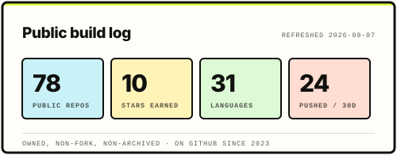
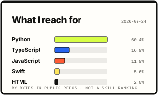

<!--
  github.com/rishabhcli profile README
  Visual direction: bone paper, ink, acid lime. Same palette as rishabhb.dev.
  All motion is SMIL inside the SVGs. Cards in assets/ are hand-built;
  stats.svg, langs.svg and the snake are regenerated daily by .github/workflows/refresh.yml.
-->

<div align="center">
  
</div>

<div align="center">
  
</div>

<div align="center">
  <a href="https://rishabhb.dev"></a>
  <a href="https://www.linkedin.com/in/rb-rishabh"></a>
  <a href="https://x.com/rb8dg"></a>
  <a href="https://github.com/rishabhcli?tab=followers"></a>
  
</div>

<div align="center">
  
</div>

## `$ whoami`

I am a software and hardware builder studying **Information Sciences + Data Science** with a minor in Computer Science at the **University of Illinois Urbana-Champaign**. I work across **agent systems**, **local-first developer tools**, **applied computer vision**, and **assistive hardware**. I am drawn to problems where software has to survive contact with something physical or human, and where a claim is only worth the evidence attached to it.

- **Agent systems:** Reproduce, repair and verify loops, MCP servers, browser automation, and explicit publication gates so a model never ships an unreviewed change.
- **Local-first tools:** Durable state in SQLite, isolated Git worktrees, and clients that keep functioning when the network does not.
- **Applied vision and sensing:** Strict provider schemas, timestamp normalization, deterministic triage rules, and visible data gaps in place of silent failure.
- **Assistive hardware:** Low-cost embedded sensing, measured accuracy, and designs evaluated against real constraints rather than demo conditions.

## `$ ls ~/ships`

<p align="center">
  <a href="https://github.com/rishabhcli/ZooVision"></a>
  <a href="https://github.com/rishabhcli/QAgent"></a>
</p>

<p align="center">
  <a href="https://rishabhb.dev"></a>
  <a href="https://github.com/rishabhcli/SafeRelay"></a>
</p>

<p align="center">
  <a href="https://github.com/Developer668/MuscleMemory"></a>
  <a href="https://github.com/rishabhcli/kinora"></a>
</p>

<p align="center">
  <a href="https://rishabhb.dev"><strong>Build notes, architecture and what is still unfinished &#8594;</strong></a>
  &nbsp;&#183;&nbsp;
  <a href="https://github.com/rishabhcli?tab=repositories"><strong>Every public repo &#8594;</strong></a>
</p>

<details>
  <summary><strong>Evidence boundaries</strong></summary>

  <br />

  Each project states what it has actually demonstrated and what remains unproven. These are the current limits.

  - **Muscle Memory.** The strongest candidate policy improved development success from 25% to 66.7% and still failed the promotion gate on two falls. No policy is promoted. The figures on that card are requirements, not results.
  - **SafeRelay.** End-to-end multi-hop delivery is unproven. A browser demo and a protocol test do not establish radio delivery, and the claim stays gated until captured three-phone field evidence exists.
  - **ZooVision.** Overlay tooltips can still surface raw detector labels that contradict the triage output. Known and unresolved.
  - **SmartCane.** Preliminary bench and simulated trials only. Not a clinical study, and not yet evaluated with the elderly users it was designed for.

</details>

## `$ cat awards.txt`

<div align="center">
  
</div>

<p align="center"><sub>Ordered by significance rather than recency. The science fair entry was a ten-month build; the hackathon awards were weekend work.</sub></p>

## `$ cat stack.txt`

<div align="center">
  <a href="https://skillicons.dev">
    
  </a>
</div>

<br />

| Product | Systems | Agents |
| :-- | :-- | :-- |
| React, Next.js, Electron, SwiftUI, Capacitor | Python, TypeScript, Go, Jac, SQLite, Neo4j, FalkorDB, BLE | MCP servers, browser agents, deterministic gates, evaluation receipts |
| Interfaces an operator can act inside | Offline-first data, background sync, native workers | Structured output, verification before acceptance, visible DataGaps |

## `$ git log --stat`

<div align="center">
  
  
</div>

<div align="center">
  <picture>
    <source media="(prefers-color-scheme: dark)" srcset="./assets/snake-dark.svg" />
    <source media="(prefers-color-scheme: light)" srcset="./assets/snake.svg" />
    
  </picture>
</div>

<p align="center"><sub>Cards and the snake regenerate every morning from the public API. Language share is repository composition, not a skill ranking.</sub></p>

## `$ cat principles.md`

```text
01  Separate what is demonstrated from what is verified, and label both.
02  Deterministic rules own any decision with safety consequences. Models describe.
03  Local-first by default. Treat the network as an enhancement.
04  Failure states are designed, not discovered. No silent placeholders.
05  Leave evidence behind: runs, artifacts, checksums, timestamps.
06  Finish the unglamorous part. It is most of the work.
```

<div align="center">
  <a href="https://rishabhb.dev"><strong>See what I am building now</strong></a>
</div>

<div align="center">
  
</div>
